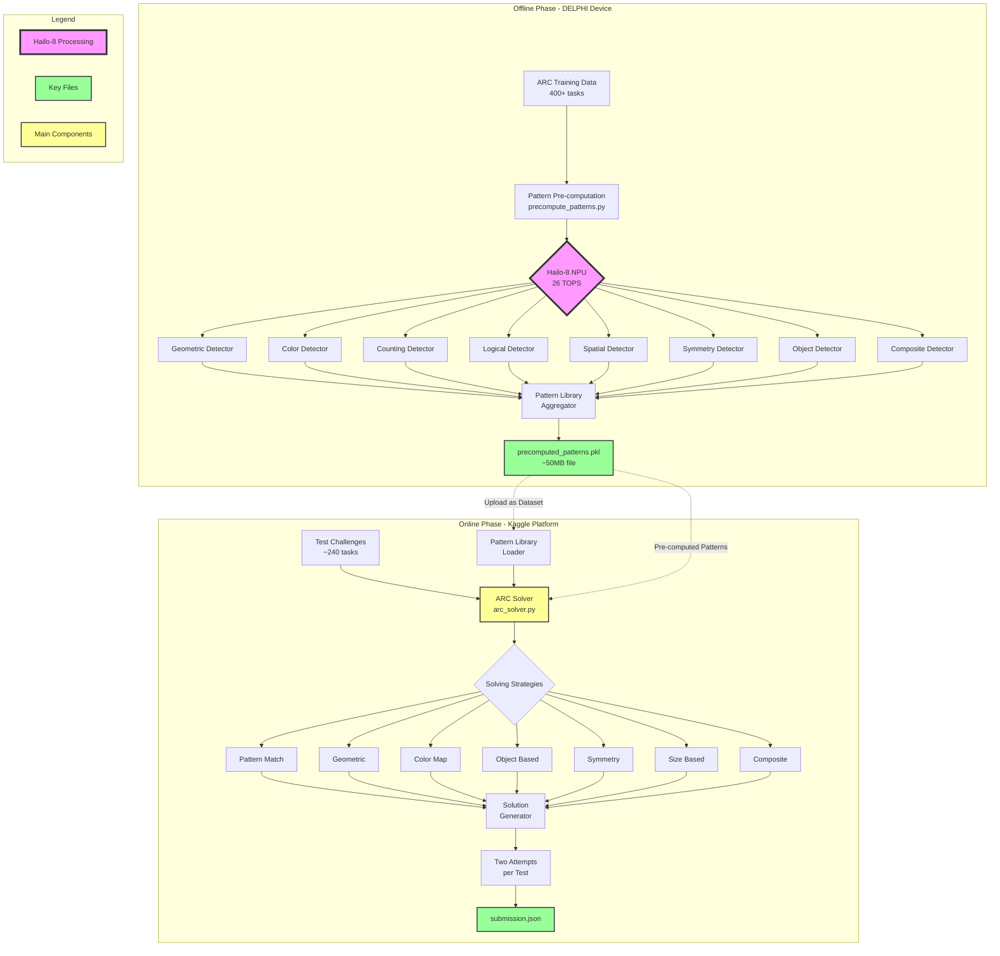

# ARC Prize 2025 - System Architecture

## Overview
This document provides the complete system architecture for our ARC Prize 2025 solution, showing how we leverage Hailo-8 NPU for offline pattern analysis and fast online inference.

## Architecture Diagram



## Component Descriptions

### Offline Phase Components

#### 1. Pattern Pre-computation Engine
- **File**: `precompute_patterns.py`
- **Hardware**: Runs on DELPHI device with Hailo-8 NPU
- **Time**: Unlimited (typically 2-4 hours)
- **Output**: Comprehensive pattern library

#### 2. Pattern Detectors (8 Specialized Models)
Inspired by your Apollo Nexus architecture:
- **Geometric**: Rotations, reflections, translations
- **Color**: Mapping and transformation rules
- **Counting**: Numerical patterns
- **Logical**: Conditional and boolean operations
- **Spatial**: Positional relationships
- **Symmetry**: Symmetrical patterns
- **Object**: Object manipulation
- **Composite**: Multi-step transformations

#### 3. Pattern Library
- **Format**: Pickled Python dictionary
- **Size**: 10-50MB depending on training data
- **Contents**: 
  - Pattern signatures
  - Transformation rules
  - Task similarity features
  - Cached solutions

### Online Phase Components

#### 1. ARC Solver
- **File**: `arc_solver.py`
- **Platform**: Runs on Kaggle
- **Time**: Must complete within 12 hours
- **Memory**: ~16GB available

#### 2. Solving Strategies
Seven complementary approaches:
1. **Pattern Match**: Direct lookup from library
2. **Geometric**: Simple transformations
3. **Color Map**: Color replacement rules
4. **Object Based**: Object manipulation
5. **Symmetry**: Symmetry operations
6. **Size Based**: Grid resizing
7. **Composite**: Complex multi-step

#### 3. Submission Generator
- **Format**: JSON with specific structure
- **Requirement**: 2 attempts per test input
- **Validation**: Ensures all tasks answered

## Data Flow

### 1. Offline Pattern Discovery
```
Training Data → Hailo-8 Analysis → Pattern Extraction → 
Feature Generation → Library Creation → PKL File
```

### 2. Online Solution Generation
```
Test Task → Feature Extraction → Similarity Search → 
Strategy Selection → Solution Application → Validation → Submission
```

## Performance Characteristics

### Offline Phase
- **Computation**: Millions of pattern hypotheses
- **Parallelism**: 8 detectors running simultaneously
- **Time**: No limit (typically 2-4 hours)
- **Output**: Single 10-50MB file

### Online Phase
- **Computation**: Minimal (mostly lookups)
- **Time per task**: 1-30 seconds
- **Total time**: ~2 hours for 240 tasks
- **Memory**: < 1GB for pattern library

## Key Advantages

1. **Computational Leverage**: Use unlimited offline time
2. **Hardware Advantage**: 26 TOPS vs standard GPU
3. **Fast Inference**: Pre-computed patterns = quick lookups
4. **Robustness**: Multiple strategies ensure coverage
5. **Scalability**: Can analyze millions of patterns offline

This architecture maximizes our chances of achieving the 85% accuracy needed for the $700K grand prize!